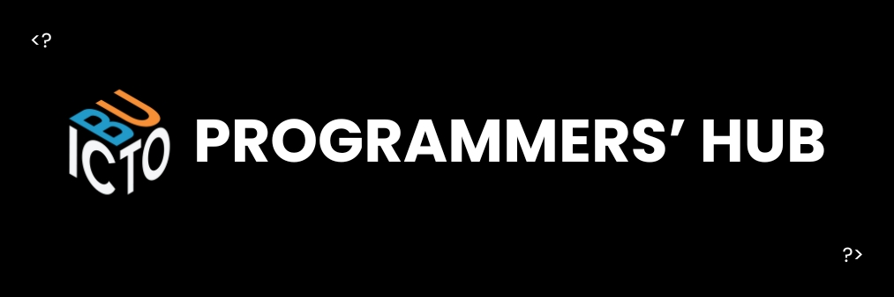

# Bicol University ICTO Programmer's Hub

Welcome to the official GitHub organization of the **Bicol University Information and Communications Technology Office (ICTO) Programmer's Hub**.

This space is dedicated to the development, maintenance, and collaboration on university-wide software systems and digital solutions.

## 📣 Contact

- **Bug Reports & Feature Requests**  
  Email: [buicto.programmershub@bicol-u.edu.ph](mailto:buicto.programmershub@bicol-u.edu.ph)

- **Security & Vulnerabilities**  
  Please report any potential security issues privately via email.

---

## 📌 Repository Guidelines

- Use meaningful commit messages.
- Follow defined coding standards.
- Submit pull requests for all changes (no direct commits to `main`).
- Include README and documentation per project.

## 📄 License

All repositories in this organization are governed by their respective LICENSE files. Unless otherwise stated, they are intended for official use within Bicol University.

---